### ¡Hola, soy Carlos! 👋 Estudiante de Ingeniería del Software en la ETSII (Sevilla) 💻✨

---

### 🚀 Sobre mí
* 📚 Actualmente cursando el grado de **Ingeniería del Software** en la Universidad de Sevilla.
* 🛠️ Apasionado del desarrollo **Full-Stack** (React Native, Node.js, Sequelize, Vite).
* 📊 Interesado en el diseño de bases de datos relacionales y el modelado matemático.

---

### ⚡ Estadísticas y GitHub Stats

